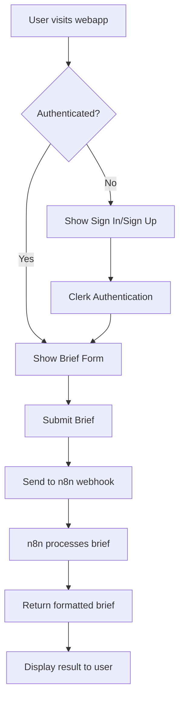

# Clerk Authentication Flow

This flowchart illustrates how the Nahana Brief App handles user authentication and brief processing.

## Flow Description

1. **User visits webapp**: When a user accesses the application
2. **Authentication Check**: The middleware checks if the user is authenticated
3. **Unauthenticated Path**: 
   - User sees Sign In/Sign Up options
   - Redirected to Clerk authentication pages
   - After successful authentication, user is redirected back
4. **Authenticated Path**:
   - User sees the Brief Form
   - Can submit brief content
   - Brief is sent to n8n webhook for processing
   - Formatted response is displayed
   - User can copy the formatted brief to clipboard

## Key Components

- **Clerk Middleware**: Handles authentication checks
- **Clerk Provider**: Wraps the application for auth context
- **API Route**: Secured endpoint that communicates with n8n
- **n8n Webhook**: External service that processes and formats briefs 